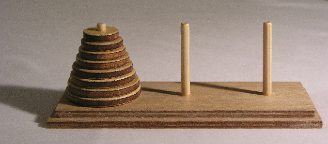
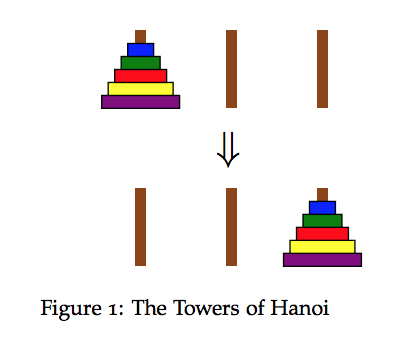
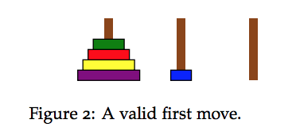
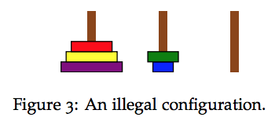

# The Towers of Hanoi



The Towers of Hanoi is a classic puzzle with a solution
that can be described recursively. Disks of different sizes are stacked
on three pegs; the goal is to get from a starting configuration with
all disks stacked on the first peg to an ending configuration with all
disks stacked on the last peg, as shown in Figure 1.



The only rules are:
- you may only move one disk at a time, and
- a larger disk may never be stacked on top of a smaller one.

For example, as the first move all you can do is move the topmost,
smallest disk onto a different peg, since only one disk may be moved
at a time.



From this point, it is illegal to move to the configuration shown in
Figure 3, because you are not allowed to put the green disk on top of
the smaller blue one.



To move n discs (stacked in increasing size) from peg a to peg b
using peg c as temporary storage,
1. move n − 1 discs from a to c using b as temporary storage
2. move the top disc from a to b
3. move n − 1 discs from c to b using a as temporary storage.

For this exercise, define a function hanoi with the following type:
```
type Peg = String
type Move = (Peg, Peg)
hanoi :: Integer -> Peg -> Peg -> Peg -> [Move]
```

Given the number of discs and names for the three pegs, hanoi
should return a list of moves to be performed to move the stack of
discs from the first peg to the second.

Note that a type declaration, like type Peg = String above, makes
a type synonym. In this case Peg is declared as a synonym for String,
and the two names Peg and String can now be used interchangeably.
Giving more descriptive names to types in this way can be used to
give shorter names to complicated types, or (as here) simply to help
with documentation.

```
Example: hanoi 2 "a" "b" "c" == [("a","c"), ("a","b"), ("c","b")]
```